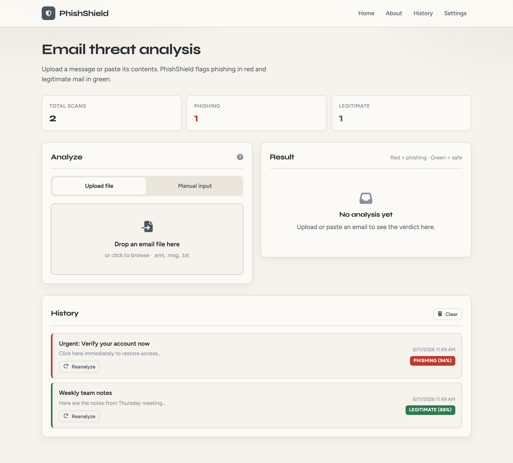
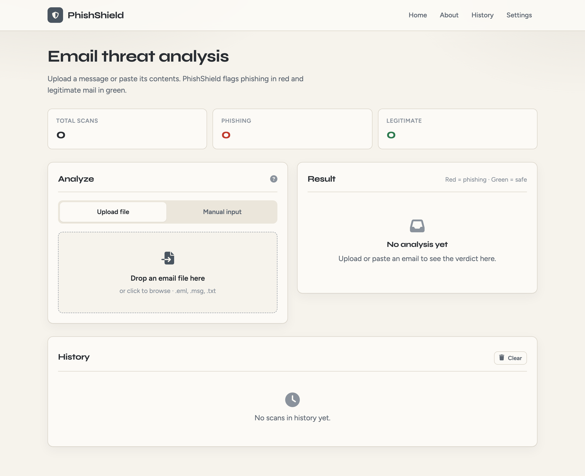
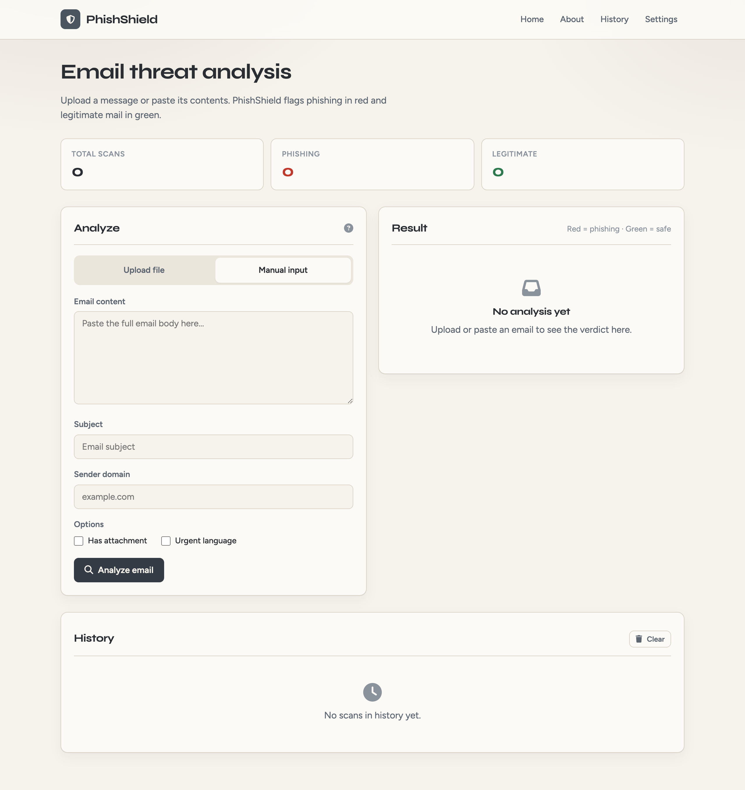
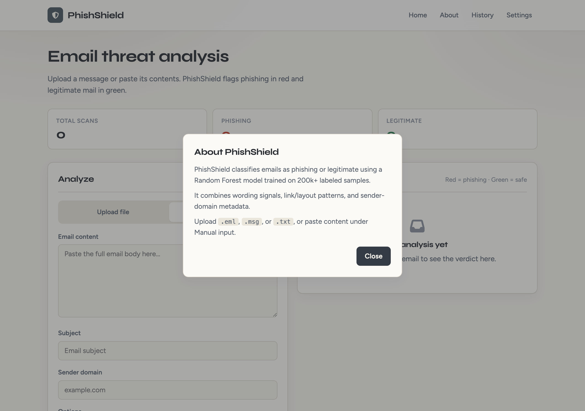
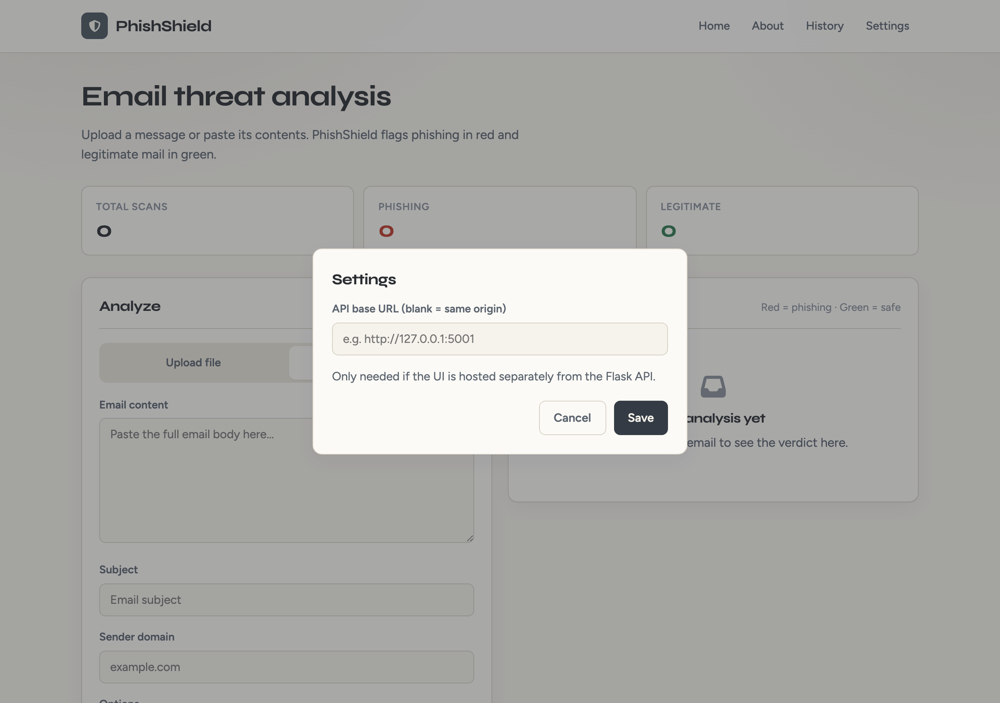
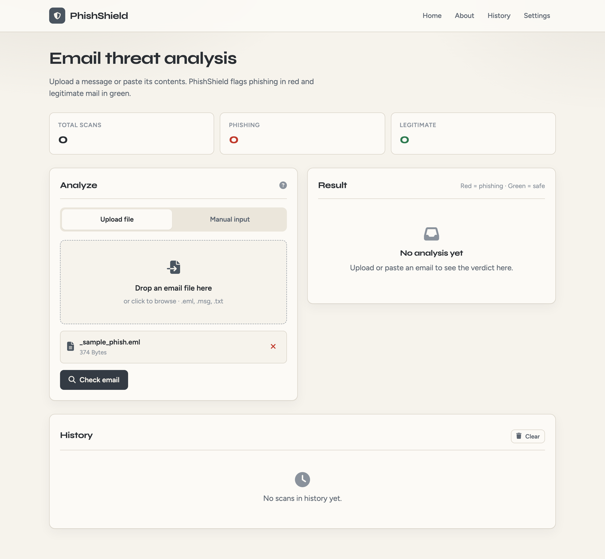
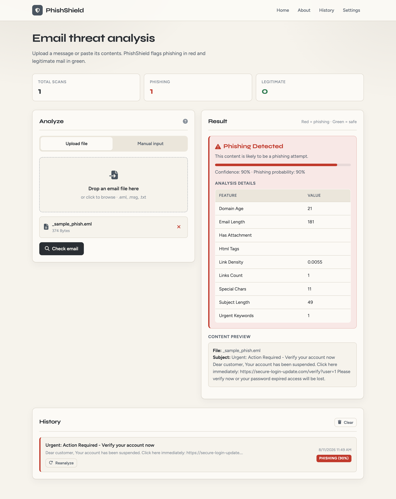
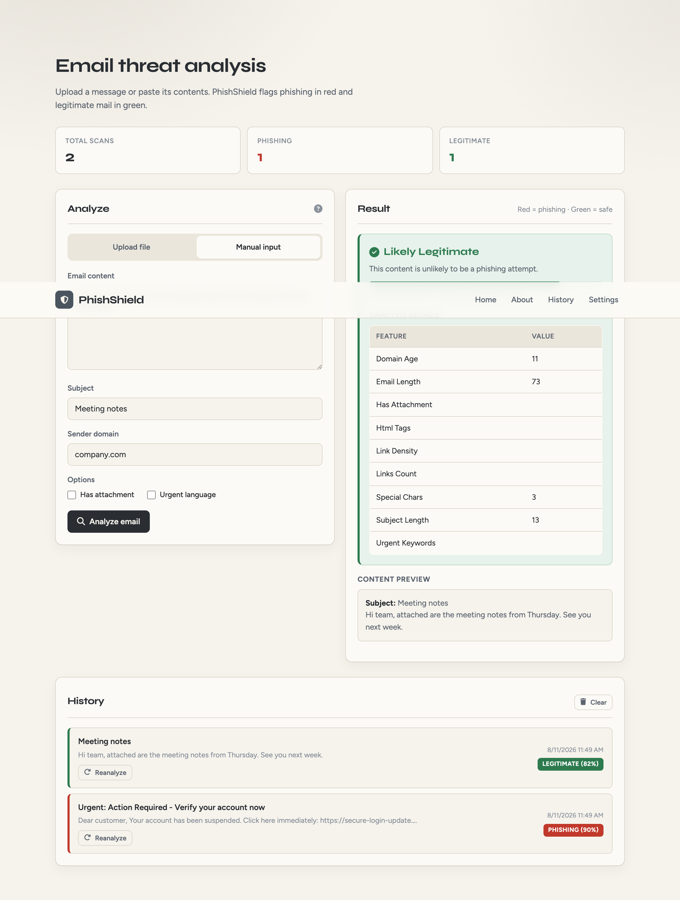
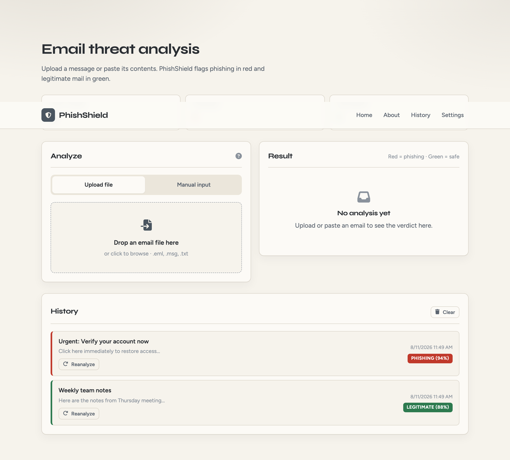
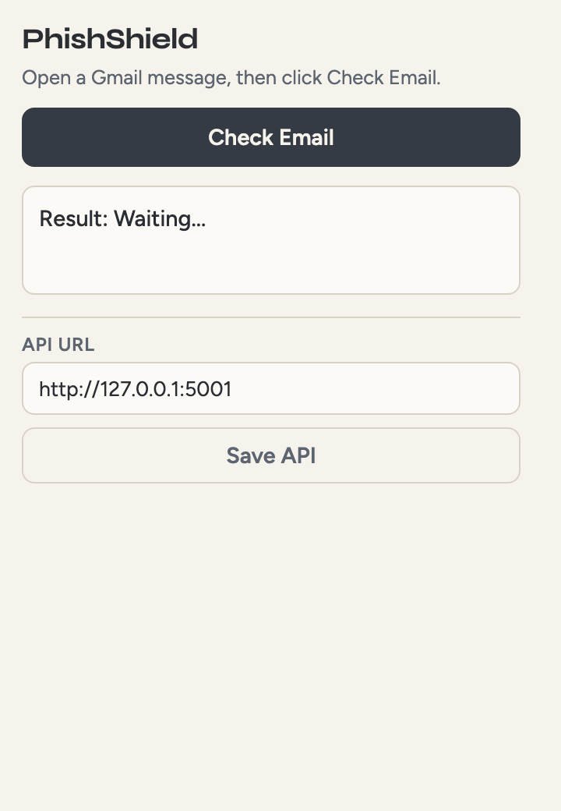

# PhishShield

PhishShield is a phishing email detection system built with a **Flask** API, a **Random Forest** classifier trained on **200,000** labeled emails, a cream/grey web UI, and an optional **Chrome extension** for Gmail.

It classifies a message as **phishing** (red) or **legitimate** (green) using wording, layout, and sender-domain features.

<p align="center">
  
</p>

---

## What’s included

| Component | Path | Role |
|-----------|------|------|
| Flask API + UI server | `app.py` | Serves the web app and prediction endpoints |
| Email parsing | `email_utils.py` | Parses `.eml` / `.txt` (optional `.msg`) |
| Model training | `train.py` | Builds and saves the Random Forest pipeline |
| Saved model | `models/phishing_detection_model.pkl` | Loaded at startup (auto-trains if missing) |
| Dataset | `dataset.csv` | 200k labeled emails |
| Web UI | `templates/index.html` | Upload / manual analysis, results, history |
| Chrome extension | `Extension/` | Checks the open Gmail message via the local API |
| Screenshots | `screenshots/` | Current UI captures |

---

## Features

### Detection
- Random Forest classifier with TF-IDF text features, domain hashing, and numeric signals
- Confidence score and phishing probability in every response
- Feature breakdown shown in the UI (links, urgent language, lengths, HTML tags, etc.)
- Auto-train fallback if the model file is missing (`python train.py` / startup)

### Web UI
- Cream & grey theme; **phishing = red**, **legitimate = green**
- **Upload file** → review the selected file → click **Check email**
- **Manual input** for pasted body, subject, sender domain, and options
- About / Settings modals, scan stats, and localStorage history with reanalyze
- Default server port **5001** (avoids macOS AirPlay on port 5000)

### Chrome extension
- Reads the open Gmail message (subject, sender, body)
- Posts to `/detect` on your local PhishShield server
- Configurable API URL (default `http://127.0.0.1:5001`)

### API
| Method | Path | Purpose |
|--------|------|---------|
| `GET` | `/` | Web UI |
| `GET` | `/health` | Model status |
| `POST` | `/predict` | JSON prediction |
| `POST` | `/detect` | Same as `/predict` (extension) |
| `POST` | `/parse` | Upload email file → parsed fields |
| `POST` | `/analyze` | Upload email file → parse + predict |

**Example `/predict` body:**
```json
{
  "email_text": "Dear customer, verify your account now: https://evil.example/login",
  "subject": "Urgent: Action required",
  "sender_domain": "evil.example",
  "has_attachment": 0,
  "urgent_keywords": 1,
  "links_count": 1
}
```

Aliases accepted for the body field: `email_text`, `text`, `body`, or `content`.

**Example response:**
```json
{
  "prediction": "phishing",
  "result": "phishing",
  "probability": 0.9,
  "confidence": 0.9,
  "features_used": {
    "links_count": 1,
    "urgent_keywords": 1,
    "email_length": 181
  }
}
```

---

## Screenshots

### Home — upload


### Manual input


### About


### Settings


### File ready — Check email


### Phishing result


### Legitimate result


### History


### Chrome extension


---

## Dataset

`dataset.csv` contains **200,000** labeled rows (`phishing` / `legitimate`).

| Column | Description |
|--------|-------------|
| `email_text` | Email body |
| `subject` | Subject line |
| `has_attachment` | `1` / `0` |
| `links_count` | Hyperlink count |
| `sender_domain` | Sender domain |
| `urgent_keywords` | `1` if urgent phrases present |
| `label` | `phishing` or `legitimate` |

At prediction time the app also derives lengths, link density, HTML tag count, special-character count, and a hash-based `domain_age` proxy (kept consistent with training; not a live WHOIS lookup).

---

## Setup

### Prerequisites
- Python 3.8+
- Git
- Chrome (only if you use the extension)

### Install & run
```bash
git clone https://github.com/Dwaynejj/Phishing-Email-Agent.git
cd Phishing-Email-Agent

python -m venv venv
# macOS / Linux
source venv/bin/activate
# Windows
# venv\Scripts\activate

pip install -r requirements.txt
python app.py
```

Open **http://127.0.0.1:5001**

Custom port:
```bash
PORT=8080 python app.py
```

### Chrome extension (Gmail)
1. Start PhishShield on port **5001**.
2. Go to `chrome://extensions` → enable **Developer mode**.
3. **Load unpacked** → select the `Extension/` folder.
4. Open a Gmail message → PhishShield icon → **Check Email**.

### Outlook `.msg` (optional)
`.eml` and `.txt` work by default. For `.msg`:
```bash
pip install extract-msg
```

### Retrain the model
```bash
python train.py
```
This overwrites `models/phishing_detection_model.pkl`.

### Refresh UI screenshots (optional)
With the server running:
```bash
pip install playwright
python -m playwright install chromium
python scripts/capture_screenshots.py
```

---

## Project layout

```
Phishing-Email-Agent/
├── app.py                 # Flask app, features, API routes
├── email_utils.py         # .eml / .txt / .msg parsing
├── train.py               # Training pipeline
├── dataset.csv            # Training data
├── models/                # Saved sklearn pipeline
├── templates/index.html   # Web UI
├── Extension/             # Chrome MV3 extension
├── screenshots/           # UI screenshots
├── scripts/               # Helper scripts (e.g. screenshot capture)
└── requirements.txt
```

---

## License

MIT — see [LICENSE.txt](LICENSE.txt).

**GitHub:** [https://github.com/Dwaynejj/Phishing-Email-Agent](https://github.com/Dwaynejj/Phishing-Email-Agent)
